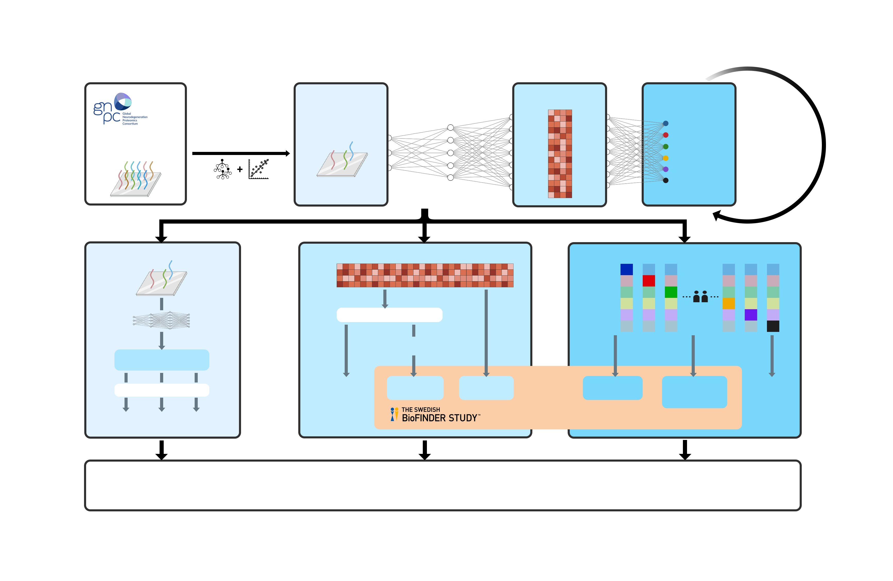

# Benchmarking the AI-based diagnostic potential of plasma proteomics for neurodegenerative disease in 17,187 people

---

## Reference

---

- An, L., Pichet Binette, A., Hristovska, I., Vilkaite, G., Xiao, Y., Smets, B., ... & Vogel J.W., (2025) [Benchmarking the AI-based diagnostic potential of plasma proteomics for neurodegenerative disease in 17,187 people](https://doi.org/10.1101/2025.06.27.25330344), MedRxiv.

## Background

---

The rapid growth of the dementia population underscores the urgent need for accessible, scalable biomarkers of neurodegenerative diseases. Such biomarkers are crucial for improving early diagnosis, confirming (co-)pathologies, and optimizing participant selection in clinical trials. This highlights the need for a one-shot, multi-disease biomarker panel, while emerging high-throughput plasma proteomics technologies offer promising avenues. In this work, we developed ProtAIDe-Dx to analyze complex, high-dimensional proteomics data from GNPC, the largest neurodegenerative disease proteomics dataset to date (N = 17,187). We hope this work establishes a robust benchmark for AI-driven proteomics approaches and supports precision medicine in neurodegenerative diseases.

## Usage

---

### Environment setup

---

- Our code uses Python, here is the setup procedure:  
  i. Install Miniconda or Anaconda with Python 3.x if you don't have conda installed;  
  ii.Create a conda environment using `conda env create -f replication/config/DeMONLab_ProtAIDe_env.yaml -n ProtAIDe`.

### Example

---

- The example of code usage is detailed in `example/README.md`

### Replication

---

- Detailed step-by-step replication instructions are provided in `replication/README.md`

## Release

---

- Release v1.0 (21/01/2025): Initial release of An_ProtAIDe-Dx project.

## Bugs & Questions

---

Please contact Lijun An at anlijuncn@gmail.com.
