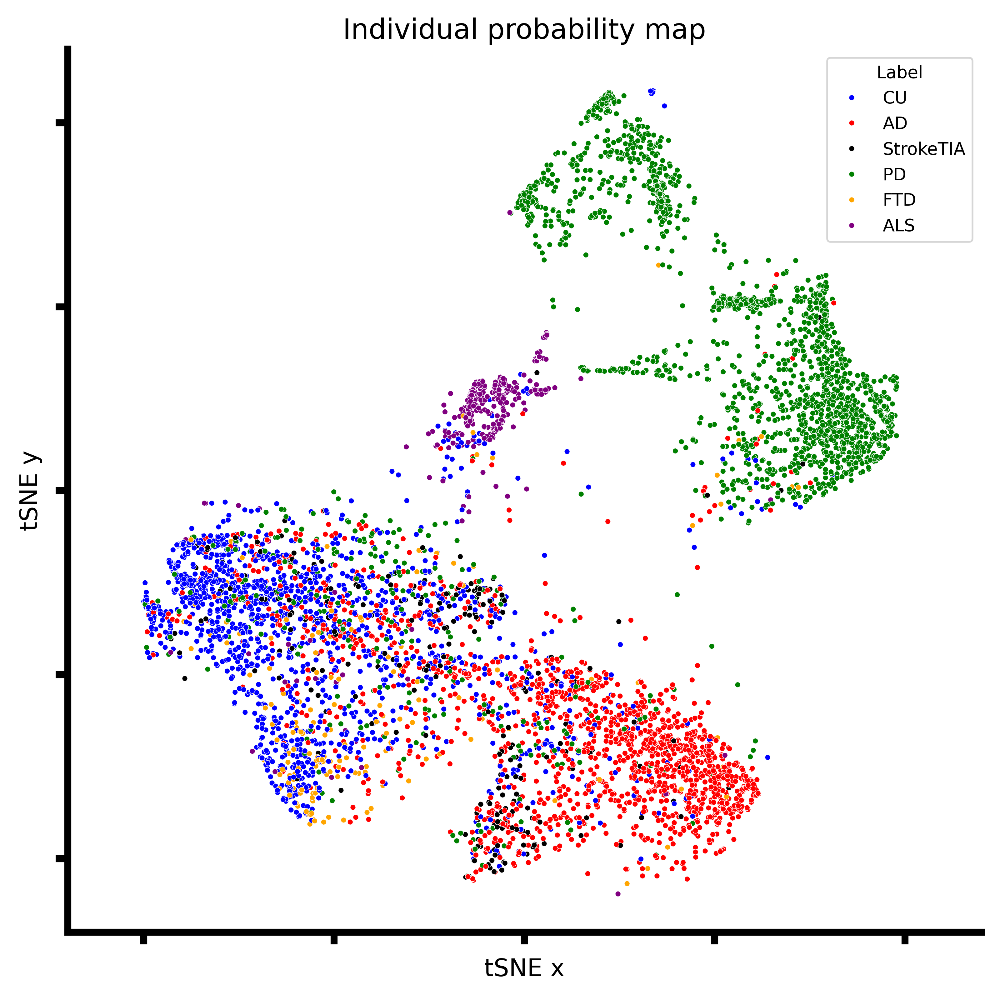
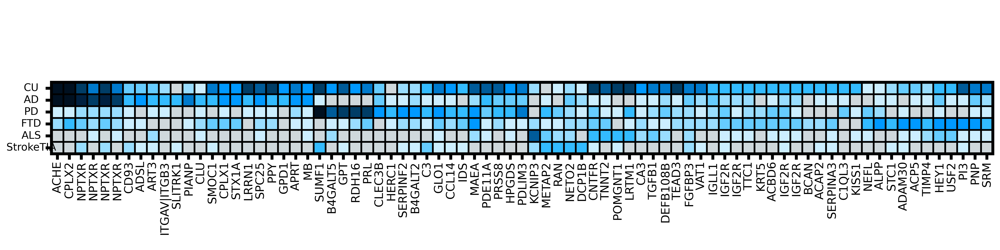
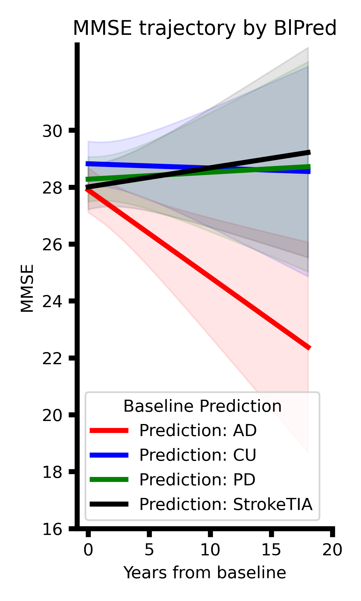
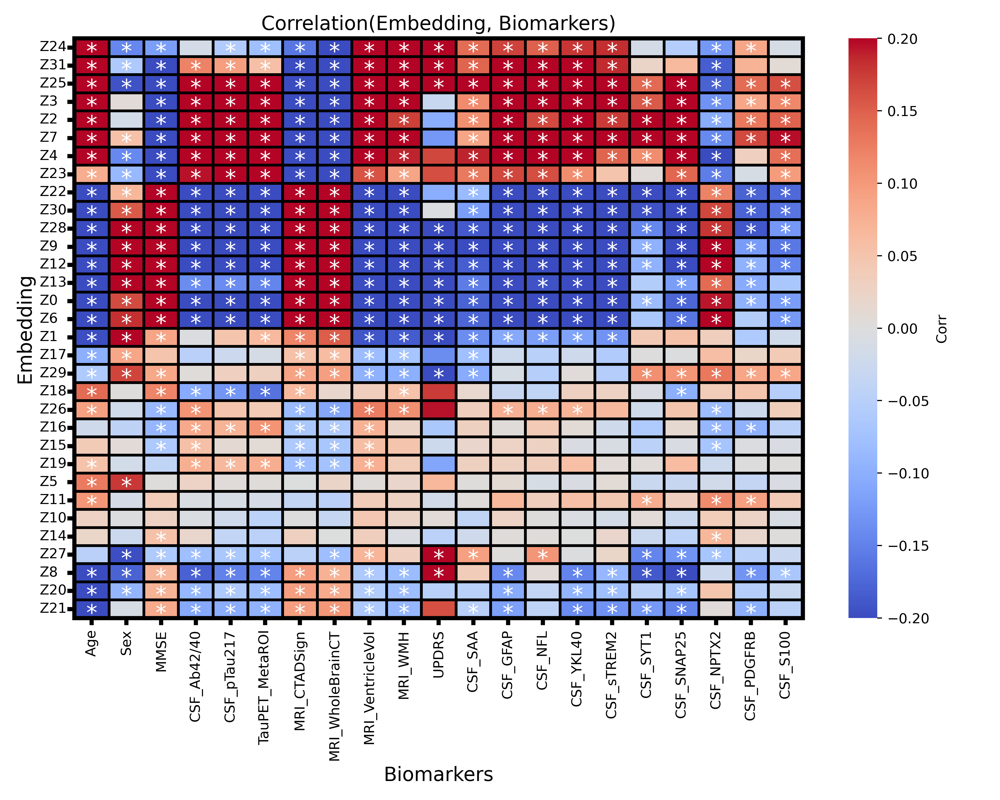
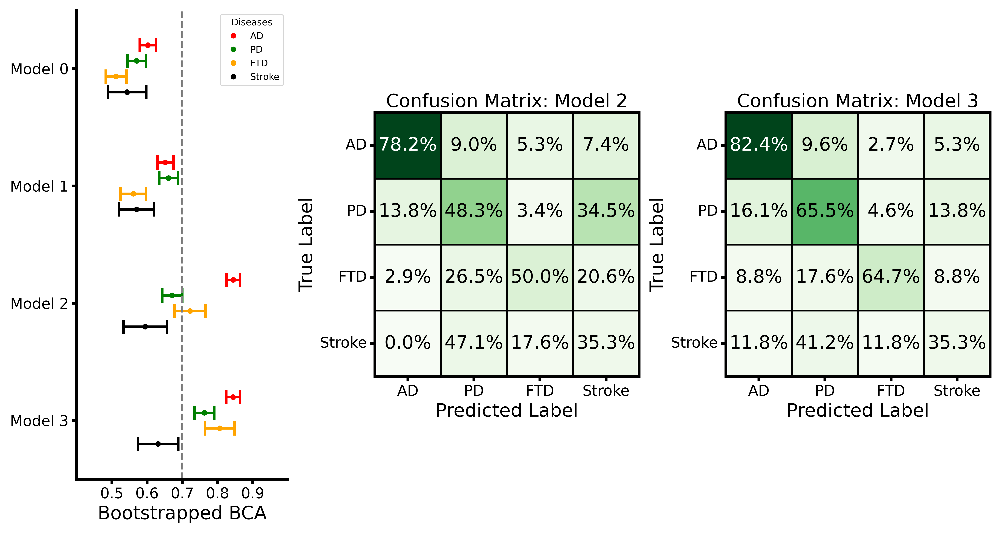
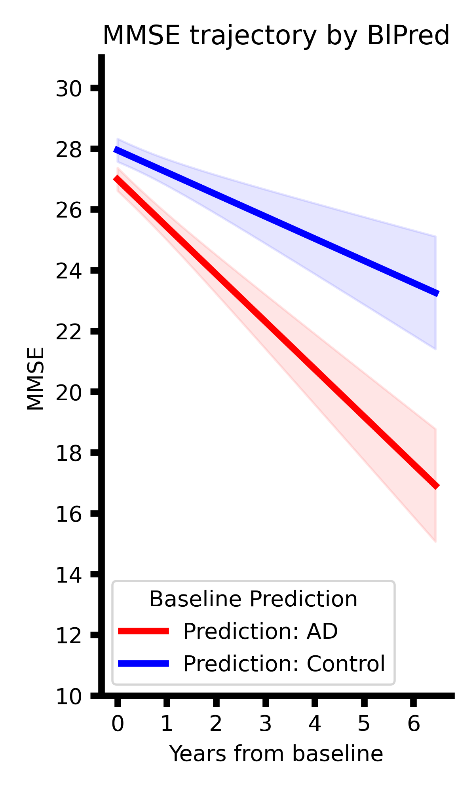

# Replication

---

In this section, we provided detailed instructions and scripts to replicate the main results in our manuscript. The replication is divided into two parts: GNPC replication and BioFINDER-2 replication.

## Setup

Given that both GNPC and BioFINDER-2 datasets contain sensitive patient information, we are unable to share the raw data directly. However, we provide detailed instructions on how to access these datasets below. After obtaining the datasets, please follow the instructions in the subsequent sections to replicate our results.

---

### Conda environment

---

We used `conda` to manage the Python environment for this project. Please create a new conda environment with following commands and install the required packages using the provided `replication/config/DeMONLab_ProtAIDe.yaml`.

```bash
conda env create -f replication/config/DeMONLab_ProtAIDe.yaml -n ProtAIDe
conda activate ProtAIDe
```

### GNPC data access

---

The Global Neurodegeneration Proteomics Consortium (GNPC) is world's largest nueuro-proteome consortium.

To access GNPC, please visit [GNPC website](https://www.neuroproteome.org/about-the-consortium) and follow the instructions to apply for data access. Once your access has been approved, you can log into the [AD Workbench platform](https://discover.alzheimersdata.org/catalogue/datasets/e2f3536b-d97b-4303-89bd-6864200807a4) to access GNPC workspace. For internal users, you can check with `Lijun` or `Jake`.

In this paper, we used the `GNPC v1.3MS` released in 2025, the version corresponding to the [GNPC bundle papers](https://www.nature.com/articles/s41591-025-03834-0).

Once you have access to the AD Workbench, you can find all GNPC data for this paper & a copy of this repository at `/files/NMED-A141173`.

### BioFINDER-2 data access

---

The [BioFINDER-2](https://biofinder.se/two/) study is a prospective cohort in the south of Sweden spanning the full continuum of AD as well as including patients with non-AD neurodegenerative diseases.

To access BioFINDER-2 data, please contact [BioFINDER Excecutive Committee](bf_executive@med.lu.se) for data access. As we noted in `Data Availability` section of our manuscript, pseudoanymized BioFINDER-2 data will be shared by request from a qualified academic investigator for the sole purpose of replicating procedures and results presented in the article and as long as data transfer is in agreement with EU legislation on the general data protection regulation and decisions by the Swedish Ethical Review Authority and Region Skåne, which should be regulated in a material transfer agreement. For internal users, you can check with `Lijun`.

## GNPC replication

---

Once you have access to GNPC workspace, you could replicate the main GNPC results in our manuscript by following the instructions below.

First of all, please find this repository at `/files/NMED-A141173/DeMONLab/An_ProtAIDe-Dx` and run following commands:

```bash
cd /files/NMED-A141173/DeMONLab/An_ProtAIDe-Dx
bash replication/scripts/step0_prepare_GNPC.sh
```

Then, you can run the following scripts to replicate the main GNPC results step by step.

### Overall performances of ProtAIDe-Dx (cross-validation)

---

To replicate the overall performances of ProtAIDe-Dx on GNPC dataset, please run:

```bash
bash replication/scripts/step1_replica_fig1_GNPC.sh
```

Once the script is done, you can see an message `Congrats! You have replicated Fig1: ProtAIDe-Dx (GNPC)` if you have successfully replicated. Meanwhile, you can see the summarized results across 10-fold in terminal like:

<div align="center">

|  Target   | AUC mean | AUC std | BCA mean | BCA std |
| :-------: | :------: | :-----: | :------: | :-----: |
|  Control  |   0.92   |  0.01   |   0.83   |  0.01   |
|    AD     |   0.91   |  0.01   |   0.82   |  0.02   |
|    PD     |   0.97   |  0.01   |   0.92   |  0.01   |
|    FTD    |   0.86   |  0.04   |   0.72   |  0.04   |
|    ALS    |   0.99   |  0.01   |   0.95   |  0.03   |
| StrokeTIA |   0.79   |  0.03   |   0.69   |  0.03   |

</div>

### Individual probability map

---

To replicate the individual probability map visualization in our manuscript, please run:

```bash
bash replication/scripts/step2_replica_fig2_GNPC.sh
```

Once the script is done, you can see an message `Congrats! You have replicated Fig2: tSNE` if you have successfully replicated. Meanwhile, you can find a very similar tSNE figure at `results/replica/Fig2/Fig2_tSNE.png` like below:

<div align="center">
  
</div>

### Model explanation

---

To replication the model explanation results in our manuscript, please run:

```bash
bash replication/scripts/step3_replica_fig3_GNPC.sh
```

Once the script is done, you can see an message `Congrats! You have replicated Fig3: permFIT` if you have successfully replicated. Meanwhile, you can find a very similar tSNE figure at `results/replica/Fig3/Fig3_ImportanceProteins.png` like below:

<div align="center">
  
</div>

### Generalization performances of ProtAIDe-Dx (leave-one-site-out)

---

To replicate the generalization performances of ProtAIDe-Dx on GNPC dataset, please run:

```bash
bash replication/scripts/step4_replica_fig4_GNPC.sh
```

Once the script is done, you can see an message `Congrats! You have replicated Fig4: ProtAIDe-Dx (GNPC)` if you have successfully replicated. Meanwhile, you can see the summarized results across 14-site in terminal like:

<div align="center">

|  Target   | AUC mean | AUC std | BCA mean | BCA std |
| :-------: | :------: | :-----: | :------: | :-----: |
|  Control  |   0.74   |  0.08   |   0.67   |  0.09   |
|    AD     |   0.81   |  0.06   |   0.73   |  0.06   |
|    PD     |   0.71   |  0.09   |   0.62   |  0.07   |
|    FTD    |   0.72   |  0.03   |   0.69   |  0.04   |
|    ALS    |   0.66   |  0.03   |   0.56   |  0.06   |
| StrokeTIA |   0.61   |  0.02   |   0.59   |  0.06   |

</div>

### MMSE trajectory by baseline predictions

---

To replication the MMSE trajectory differentiable by baseline predictions in our manuscript, please run:

```bash
bash replication/scripts/step5_replica_fig5_GNPC.sh
```

Once the script is done, you can see an message `Congrats! You have replicated Fig5: MMSE Trajectory (GNPC)` if you have successfully replicated. Meanwhile, you can find a very similar tSNE figure at `results/replica/Fig5/Fig5_LME_GNPC.png` like below:

<div align="center">
  
</div>

## BioFINDER-2 replication

---

Once you have access to BioFINDER-2 dataset (`BF2_Soma7k_Baseline.csv` and `BF2_MMSE_long.csv`), you could replicate the main BF2 results in our manuscript by following the instructions below.

First, please run following commands to prepare the data folders:

```bash
bash replication/scripts/step0_prepare_folders_BF2.sh
```

Remember to put `BF2_Soma7k_Baseline.csv` and `BF2_MMSE_long.csv` under `data/replica/raw/` folder.

Then, you can run the following scripts to replicate the main BF2 results step by step.

### K-shot learning performances of ProtAIDe-Dx

---

To replicate the k-shot learning performances of ProtAIDe-Dx on BioFINDER-2 dataset, please run:

```bash
bash replication/scripts/step6_replica_fig4_BF2.sh
```

Once the script is done, you can see an message `Congrats! You have replicated Fig4: K-shot (BF2)` if you have successfully replicated. Meanwhile, you can see the summarized results across 20 different samplings settings in terminal like:

<div align="center">

|  Target   | AUC mean | AUC std | BCA mean | BCA std |
| :-------: | :------: | :-----: | :------: | :-----: |
|  Control  |   0.77   |  0.01   |   0.70   |  0.01   |
|    AD     |   0.81   |  0.01   |   0.73   |  0.01   |
|    PD     |   0.74   |  0.01   |   0.68   |  0.02   |
|    FTD    |   0.57   |  0.05   |   0.55   |  0.04   |
| StrokeTIA |   0.68   |  0.02   |   0.62   |  0.02   |

</div>

Thanks to the rich biomarkers available in BioFINDER-2, we could also correlate these biomarkers with embeddings of ProtAIDe-Dx model. You should see an message `Congrats! You have replicated Fig4: Embedding-Biomarker Corr` if you have successfully replicated. Meanwhile, you can find a very similar heatmap figure at `results/replica/Fig4_BF2/EmbBiomarkerCorr/Fig4_BF2_EmbBiomarkerCorr.png` like below:

<div align="center">
  
</div>

### Clinical utility validation

---

We focused two key clinical utility experiments: (1) Add-on values of ProtAIDe-Dx over state-of-the-art clinical biomarker panel in differentiating etiological diagnosis; (2) Differentiating longitudinal MMSE decline trajectory by baseline prediction of ProtAIDe-Dx.

To replicate the two key clinical utility validation results of ProtAIDe-Dx, please run:

```bash
bash replication/scripts/step7_replica_fig5_BF2.sh
```

[1] Once the script is done, you can see an message `Congrats! You have replicated Fig5: Differential Diagnosis` if you have successfully replicated. Meanwhile, you can find two very similar figures at `results/replica/Fig5_BF2/DifferentialDiagnosis/Fig5_BF2_DiffDx` like below:

<div align="center">
  
</div>

[2] Once the script is done, you can see an message `Congrats! You have replicated Fig5: MMSE Trajectory (BF2)` if you have successfully replicated. Meanwhile, you can find two very similar figures at `results/replica/Fig5_BF2/MMSE_Trajectory/Fig5_BF2_MMSE_MCI` like below:

<div align="center">
  
</div>

## Clean up

---

Once you have finished the replication, you can clean up the generated results by running:

```bash
bash replication/scripts/step8_clean_replica.sh
```

## Bugs and questions

---

Please contact Lijun An at anlijuncn@gmail.com for any questions or issues.
